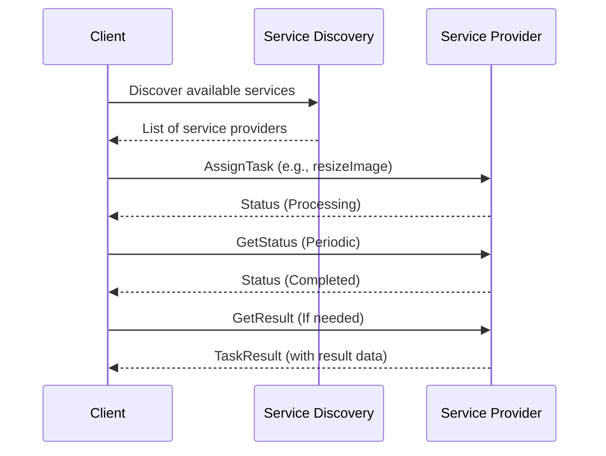
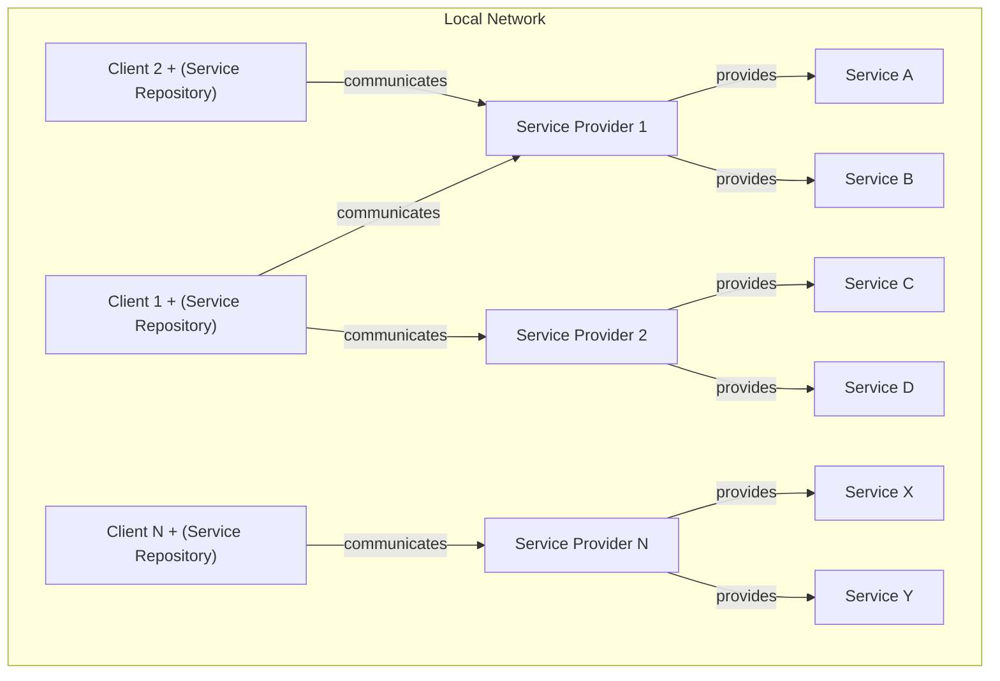

# Service-Oriented API Interface Design Document

**Date:** July 2, 2025  
**Author:** Omid Ardestani   
**Version:** 1.1

---

## 1. Introduction
This document outlines the design and architecture for a Service-Oriented API Interface intended for Windows desktop applications and Windows services operating within the same local network. The core communication leverages WebSockets with JSON-formatted messages for real-time, two-way interaction. A key architectural decision is a decentralized "Client-as-Service-Repository" pattern for service discovery, enhancing autonomy and resilience.

This document is updated to reflect the current Python-based implementation, which uses UDP for discovery, WebSockets for service communication, and a PyQt5 GUI for client-side service browsing.

## 2. Goals & Key Principles
- **Real-time Communication:** Enable instant, bidirectional data exchange between clients and service providers.
- **Decentralized Service Discovery:** Allow clients to dynamically discover available services without a central registry.
- **Scalability (within local network):** Support the addition of new clients and service instances without significant reconfiguration.
- **Reliability:** Implement mechanisms for connection stability and message delivery assurance.
- **Security:** Ensure secure communication channels and control access to services.
- **Ease of Development:** Utilize well-supported technologies within the Python ecosystem (e.g., asyncio, websockets, PyQt5).

## 3. Architecture Overview: Decentralized Client-as-Service-Repository
The architecture is characterized by its decentralized nature, where each client application takes on the responsibility of discovering and managing its own view of available services.

### 3.1. Core Components
1. **Service Providers:**
    - Python applications (e.g., Image Processing Service) running on various machines within the local network.
    - Each service provider hosts its own WebSocket server to accept direct connections from clients.
    - Responsible for performing specific business logic and executing tasks (see `main_sp.py`).
    - Actively participate in the service discovery mechanism by broadcasting their presence and capabilities.
2. **Client Applications:**
    - Desktop applications (with PyQt5 GUI) running on user machines.
    - Each client incorporates a "Service Repository" module/component (see `service_repository.py`).
    - This module handles service discovery, stores information about available services, and manages active WebSocket connections to selected service providers.
    - Exposes an interface to the rest of the client application for requesting services and receiving task updates.
    - Clients are not just consumers; they possess the intelligence to find and interact directly with service providers.

### 3.2. Communication Protocols
- **Primary Data Exchange:** WebSockets (optionally WSS/TLS) for persistent, two-way, real-time communication between clients and service providers.
- **Service Discovery:** UDP Broadcast for initial discovery and periodic heartbeats within the local network.
- **Data Serialization:** JSON for all messages exchanged over both WebSocket and UDP.

## 4. Service Discovery Mechanism (UDP Broadcast)
This mechanism allows for dynamic, self-organizing discovery of services on the local network.

### 4.1. Common Discovery Port
- A predefined, well-known UDP port (e.g., 50001) is used by all clients and service providers for discovery messages. Both components must listen on and send to this port.

### 4.2. ClientServiceDiscoveryRequest (Client Broadcast)
- **Purpose:** Sent by a client's "Service Repository" to initiate or refresh its list of available services.
- **Trigger:** On application startup, periodically (e.g., every 5 minutes), or upon user request to refresh services.
- **Sender:** Client Application (Service Repository component).
- **Recipient:** All devices listening on the well-known UDP discovery port within the broadcast domain.
- **JSON Structure:**
```json
{
  "discoveryType": "ClientServiceDiscoveryRequest",
  "clientId": "unique-client-app-instance-id-XYZ",
  "timestamp": "2025-07-02T11:45:00Z"
}
```

### 4.3. ServiceAdvertisement (Service Broadcast Response)
- **Purpose:** Sent by service providers to announce their presence and capabilities.
- **Trigger:**
    - Upon receiving a ClientServiceDiscoveryRequest.
    - Periodically (e.g., every 30-60 seconds) as a "heartbeat" to indicate continued availability.
    - Upon startup or significant status changes.
- **Sender:** Service Provider.
- **Recipient:** All devices listening on the well-known UDP discovery port within the broadcast domain.
- **JSON Structure:**
```json
{
  "discoveryType": "ServiceAdvertisement",
  "serviceId": "unique-instance-id-of-this-service-001",
  "serviceName": "ImageProcessingService",
  "serviceVersion": "1.2.0",
  "endpoint": "ws://127.0.0.1:8080", // Python demo uses ws:// for local, use wss:// for production
  "capabilities": [
    {"key": "resizeImage", "settings": [{"string": "inputPath"}, {"string": "output"}, {"int": "width"}, {"int": "height"}]},
    {"key": "applyFilter", "settings": [{"string": "name"}, {"float": "size"}]},
    {"key": "convertFormat", "settings": [{"float": "format"}]}
  ],
  "status": "Online",
  "load": 0.0,
  "timestamp": "2025-07-02T11:45:05Z",
  "respondsToClientId": "unique-client-app-instance-id-XYZ"
}
```

### 4.4. Client "Service Repository" Logic
- **Listening:** Continuously monitors the discovery UDP port for ServiceAdvertisement messages.
- **Storage:** Maintains a local in-memory collection of discovered services, indexed by serviceId and serviceName. Each entry includes the endpoint, capabilities, status, load, and a lastSeenTimestamp.
- **Update & Expiration:**
    - Upon receiving a ServiceAdvertisement, updates the corresponding service entry or adds a new one.
    - If a service's lastSeenTimestamp is older than a predefined threshold (e.g., 3x heartbeat interval), it's marked as unavailable or removed from the active list.
- **Service Selection:** When the client application requests a serviceName (e.g., "ImageProcessingService"), the repository selects an available instance based on:
    - status ("Online" preferred)
    - load (lower load preferred, if multiple instances available)
    - capabilities (matching the required operation)
    - Simple client-side load balancing strategies like round-robin can be applied for multiple healthy instances.

## 5. WebSocket Communication (WS + JSON)
Once a client has discovered a service's endpoint, it establishes a WebSocket connection.

### 5.1. WebSocket (WS/WSS)
- All WebSocket connections SHOULD use wss:// (WebSocket Secure) for production, but the Python demo uses ws:// for local development.

### 5.2. Common WebSocket Message Fields
All JSON messages exchanged over WebSockets should include:
- `type`: string - Indicates the message's purpose (e.g., "AssignTask", "TaskStatusUpdate").
- `messageId`: string (UUID/GUID) - Unique identifier for the message, used for tracking and optional acknowledgments.
- `timestamp`: string (ISO 8601) - When the message was sent.
- `payload`: object - Contains the specific data relevant to the message type.

### 5.3. Client to Service Provider Messages
1. **AssignTask Message:**
    - **Purpose:** Client requests a service provider to execute a task.
    - **Payload:**
```json
{
  "type": "AssignTask",
  "messageId": "client-task-request-uuid-1",
  "timestamp": "2025-07-02T11:50:00Z",
  "payload": {
    "taskId": "client-generated-unique-task-id-123",
    "serviceName": "ImageProcessingService",
    "operation": "resizeImage",
    "taskParameters": {
      "inputPath": "C:\\Data\\Raw\\image.png",
      "outputPath": "C:\\Data\\Processed\\resized.jpg",
      "width": 1024,
      "height": 768
    },
    "callbackClientId": "unique-client-app-instance-id-XYZ"
  }
}
```
2. **CancelTask Message (Optional):**
    - **Purpose:** Client requests to cancel a previously assigned, in-progress task.
    - **Payload:**
```json
{
  "type": "CancelTask",
  "messageId": "client-cancel-request-uuid-A",
  "timestamp": "2025-07-02T11:55:00Z",
  "payload": {
    "taskId": "client-generated-unique-task-id-123",
    "originalClientId": "unique-client-app-instance-id-XYZ"
  }
}
```

### 5.4. Service Provider to Client Messages
1. **TaskStatusUpdate Message:**
    - **Purpose:** Service provides real-time progress updates for a task.
    - **Trigger:** Sent periodically or upon significant state changes during task execution.
    - **Payload:**
```json
{
  "type": "TaskStatusUpdate",
  "messageId": "service-update-uuid-A",
  "timestamp": "2025-07-02T12:00:00Z",
  "payload": {
    "taskId": "client-generated-unique-task-id-123",
    "status": "Processing",
    "progressPercentage": 75,
    "message": "Applying filters...",
    "estimatedTimeRemainingSeconds": 30,
    "originalClientId": "unique-client-app-instance-id-XYZ"
  }
}
```
2. **TaskResult Message:**
    - **Purpose:** Service sends final results upon successful task completion.
    - **Payload:**
```json
{
  "type": "TaskResult",
  "messageId": "service-result-uuid-B",
  "timestamp": "2025-07-02T12:05:00Z",
  "payload": {
    "taskId": "client-generated-unique-task-id-123",
    "status": "Completed",
    "resultData": {
      "outputImagePath": "C:\\Data\\Processed\\final_image.jpg",
      "processedByServiceId": "image-proc-service-001",
      "executionDurationMs": 15000
    },
    "originalClientId": "unique-client-app-instance-id-XYZ"
  }
}
```
3. **TaskFailed Message:**
    - **Purpose:** Service reports an error during task execution.
    - **Payload:**
```json
{
  "type": "TaskFailed",
  "messageId": "service-fail-uuid-C",
  "timestamp": "2025-07-02T12:08:00Z",
  "payload": {
    "taskId": "client-generated-unique-task-id-123",
    "status": "Failed",
    "errorMessage": "Input file not found.",
    "errorCode": "FILE_NOT_FOUND",
    "details": "Could not locate 'C:\\Data\\Raw\\image.png'.",
    "originalClientId": "unique-client-app-instance-id-XYZ"
  }
}
```

## 6. Error Handling & Reliability
- **WebSocket Ping/Pong:** Both clients and service providers should implement WebSocket ping/pong messages to actively maintain connections and detect network disconnections.
- **Connection Retries with Exponential Backoff:** Clients should implement robust retry logic with exponential backoff when attempting to establish a WebSocket connection to a service provider (after discovery, or upon disconnection).
- **Message Acknowledgment (Optional for Critical Messages):** For mission-critical AssignTask messages, consider implementing a custom JSON acknowledgment mechanism:
    - The sender (Client) includes an acknowledgmentId in the message.
    - The receiver (Service Provider) sends a generic "Ack" message back containing the acknowledgmentId of the message it successfully processed.
    - The sender maintains a queue of unacknowledged messages and retries sending after a timeout if no Ack is received.
- **Idempotency:** Task assignment messages (AssignTask) should be designed to be idempotent. Service providers should use the taskId from the client to detect and ignore duplicate requests, preventing multiple processing of the same task if a client retries due to a lost acknowledgment.
- **Graceful Disconnection:** Implement proper WebSocket closing handshakes (close frame) to allow for clean disconnections.
- **Robust Exception Handling:** Implement comprehensive try-except blocks and logging in both client and service applications to gracefully handle malformed JSON, invalid payloads, network issues, and internal processing errors.

## 7. Security Considerations
Given the local network environment and the nature of Windows applications, robust security is paramount.
- **TLS/SSL (WSS):** Recommended for all WebSocket communication. This encrypts data in transit, preventing eavesdropping and man-in-the-middle attacks. Ensure valid certificates are used (self-signed for internal networks, or enterprise CA if available).
- **Authentication:**
    - **API Keys/Shared Secrets:** Clients may include a pre-shared API key or a session token in the initial AssignTask message or a dedicated Authenticate message. The service provider validates this key/token.
- **Authorization:**
    - After authentication, the service provider must authorize the client. Each service should verify that the authenticated callbackClientId is permitted to request the specific serviceName and operation.
    - Implement fine-grained access control lists (ACLs) or role-based access control (RBAC) within each service.
- **Input Validation & Sanitization:** All incoming JSON payloads (especially taskParameters) must be rigorously validated and sanitized by service providers to prevent injection attacks and ensure data integrity.
- **Rate Limiting (Optional):** If a service is susceptible to being overwhelmed, implement rate limiting on WebSocket messages per client connection to prevent denial-of-service attempts.
- **Firewall Configuration:** Ensure Windows Firewall and any network firewalls are configured to allow:
    - UDP traffic on the chosen discovery port (50001).
    - TCP traffic on the WebSocket ports (e.g., 8080 for WS/WSS).

## 8. Implementation Notes (Python)
- **WebSocket Servers/Clients:** Use `websockets` or `asyncio` for Python.
- **UDP Sockets:** Use `socket` and `asyncio` for broadcast/multicast discovery.
- **JSON Serialization/Deserialization:** Use Python's built-in `json` module.
- **Unique IDs:** Use `uuid.uuid4()` for messageId, taskId, clientId, and serviceId.
- **Heartbeats:** Utilize `asyncio` timers or similar for periodic message sending.
- **GUI:** The client uses PyQt5 for a modern desktop interface.

## 9. Future Considerations
- **Load Balancing (Advanced):** If client-side load balancing based on load proves insufficient, consider implementing a more sophisticated load balancing algorithm within the "Service Repository."
- **Centralized Logging & Monitoring:** While decentralized, integrating a centralized logging (e.g., ELK stack) and monitoring solution (e.g., Prometheus/Grafana) would greatly aid in system observability.
- **Fault Tolerance:** For highly critical tasks, consider durable message queuing (e.g., RabbitMQ/Kafka for task queues within the service provider or between clients/services for specific critical flows) to ensure "at-least-once" delivery guarantees beyond simple acknowledgments.

---

## Scenario Overview

This project demonstrates a Service Oriented Architecture (SOA) where clients can discover, interact with, and utilize services provided by independent service providers. The system consists of:

- **Service Providers**: Each provider registers itself with a discovery mechanism, advertises its capabilities (such as image processing operations), and exposes a WebSocket server to handle client requests.
- **Clients**: Clients discover available services, browse their capabilities, and assign tasks (e.g., image processing jobs) to selected providers. Clients can also query the status and results of submitted tasks.
- **Discovery Mechanism**: Enables dynamic registration and discovery of services, allowing clients to find and interact with providers without hardcoded endpoints.

### Example Flow
1. A service provider starts, registers itself, and advertises its capabilities (e.g., image resizing, filtering).
2. A client starts, discovers available services, and displays them in a GUI.
3. The client assigns a task (e.g., resize an image) to a selected provider.
4. The provider processes the task and updates the client with status and results.

## Sequence Diagram

Below is a sequence diagram illustrating the communication between a client and a service provider:



---

This diagram shows the typical interactions: service discovery, task assignment, status/result queries, and responses. The architecture supports extensibility for additional services and operations.

# Network Schema: Service-Oriented API Interface (Local Network)

This diagram shows the communication flow between clients and service providers in a local network, focusing on the nodes and their interactions. Each service provider can offer multiple services, and each client acts as a service repository.

## Network Topology



---

This schema demonstrates the decentralized, peer-to-peer nature of the architecture, showing that each client maintains its own service repository, which stores information about available service providers and their services within a local network.
